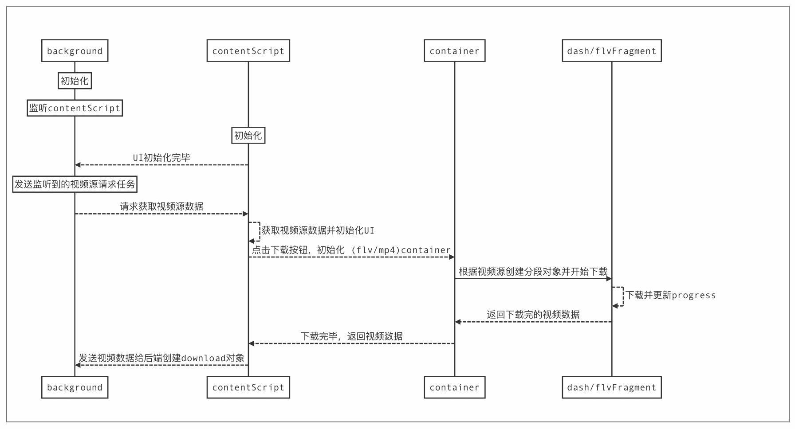

# videoModule


先看一下该模块的一个大概的序列图，其主要描述了以下几个问题：

1. contentScript页面打开后，UI加载的数据是哪儿来的？
2. 点击下载后发生了什么？



```sequence
Note over background: 初始化
Note over background: 监听contentScript
Note over contentScript: 初始化
contentScript-->background: UI初始化完毕
Note over background: 发送监听到的视频源请求任务
background-->contentScript: 请求获取视频源数据
contentScript-->contentScript: 获取视频源数据并初始化UI
contentScript-->container:点击下载按钮，初始化 (flv/mp4)container
container-> dash/flvFragment: 根据视频源创建分段对象并开始下载
dash/flvFragment-->dash/flvFragment: 下载并更新progress
dash/flvFragment-->container: 返回下载完的视频数据
container-->contentScript: 下载完毕，返回视频数据
contentScript-->background: 发送视频数据给后端创建download对象
```


## 1. contentScript页面打开后，UI加载的数据是哪儿来的？

**本模块使用MessageStore模块实现与UI的异步通信**

有如下几点需要知道：

1. 视频源数据有两种方式可以获取到：
   1. 有的页面中会静态渲染有js脚本，在页面输出`window.__playinfo__`，即为页面打开时的视频源数据；
   2. 有的页面会请求视频源，此时先在background监听，待UI初始化完毕再次进行请求即可获取视频源；
2. 除非chrome.debug，否则无法在background监听后获取请求返回的response，所以只能再请求一次。


## 2.点击下载后发生了什么？

如序列图中所示，当下载按钮被点击后，会先创建一个容器（container），并使用视频源数据初始化这个容器。

这个容器会根据视频源数据自动创建分段对象（dash/FLVFragment）并开始下载。

下载过程中，容器会以700ms的频率获取每个分段对象的进度并最后得出总进度，并更新视图。

下载总进度为100%后：

1. 如果是flv格式，使用FLV库进行分段合并，并发送视频数据BLOB给background创建下载请求；
2. 直接将视频数据BLOB给background创建下载请求。

**注意**：由于可以直接下载完整长度的dash分段，所以并不需要合并dash的操作直接输出即可。
